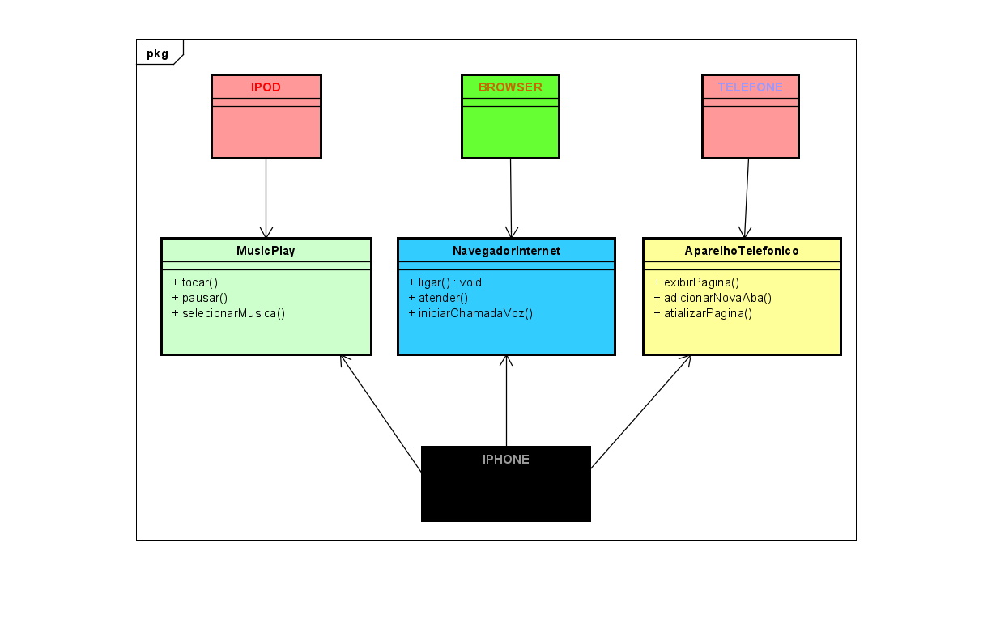

<h1 align="center">
 DESAFIO-DIO-IPHONE
</h1>

<p align="center">
	<b><i>
Modelagem e diagramação da representação em UML e Código no que se refere ao componente iPhone. 
  </i></b>
</p>

<p align="center">
	
	
</p>

## 💡 Sobre o projeto
Elabore em uma ferramenta de UML de sua preferência a diagramação das classes e interfaces com a proposta de representar os papéis do iPhone de: Reprodutor Musicial,  Aparelho Telefônico e Navegador na Internet. Em seguida crie as classes e interfaces no formato de arquivos .java
<ol>
    <li>Elaboração UML do projeto</li>
    <li>Reprodutor musical</li>
    <li>Aparelho Telefônico</li>
    <li>Navegador internet</li>
</ol>

 <br>

## 📁 Estrutura/
- [Projeto DiO Iphone](https://github.com/lecooliveirastartdev/dio-java-rep/tree/main/Desafio-DIO-Iphone) / Pasta com projeto
- [DiagramaIphone Astah](https://github.com/lecooliveirastartdev/dio-java-rep/blob/main/Desafio-DIO-Iphone/src/UML.png) / Diagrama de Classes.
- ```README.md```  Informações do projeto.  
## 📍 Instruções 

### Pré-Requisitos

###### Comportamentos esperados:
* Repodutor Musicial: tocar, pausar, selecionarMusica
* Aparelho Telefônico: ligar, atender, iniciarCorrerioVoz
* Navegador na Internet: exibirPagina, adicionarNovaAba, atualizarPagina

##  🔧 Tecnologias

  
## 🔗 Referências
- Videoaulas do Bootcamp na plataforma da DIO


## ✅ Feedback

Caso tenha algum feedback, entre em contato!

<a href = "mailto:lecopliveirastartde"></a> 
<br>

<p align="center"> LECO OLIVEIRA </p>